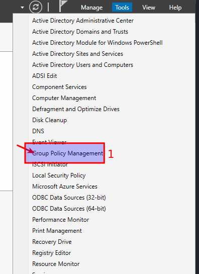
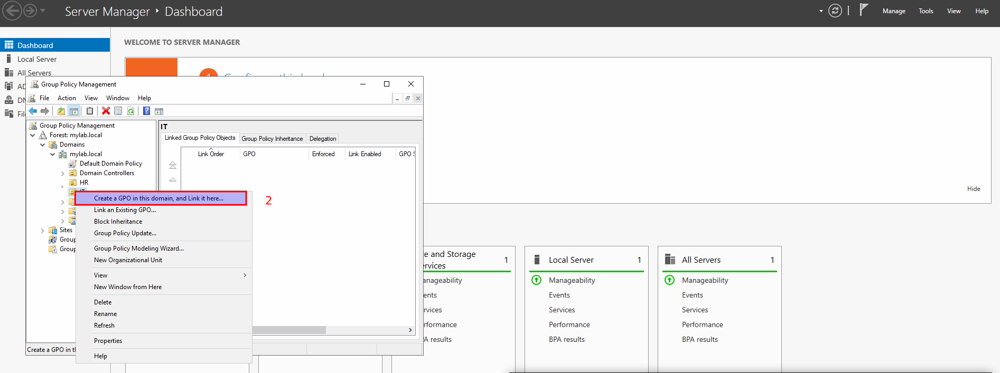
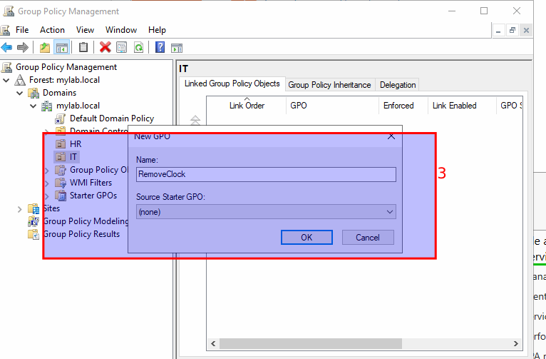
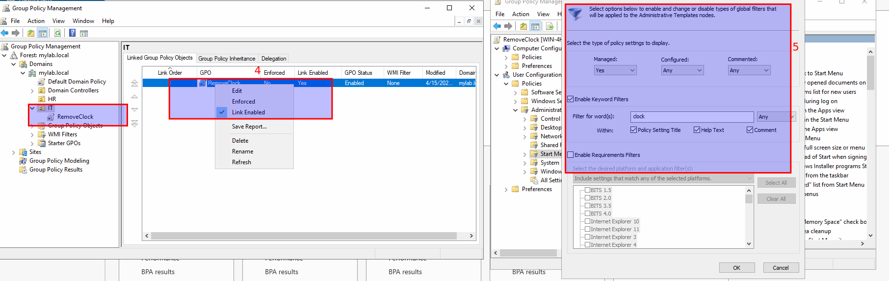
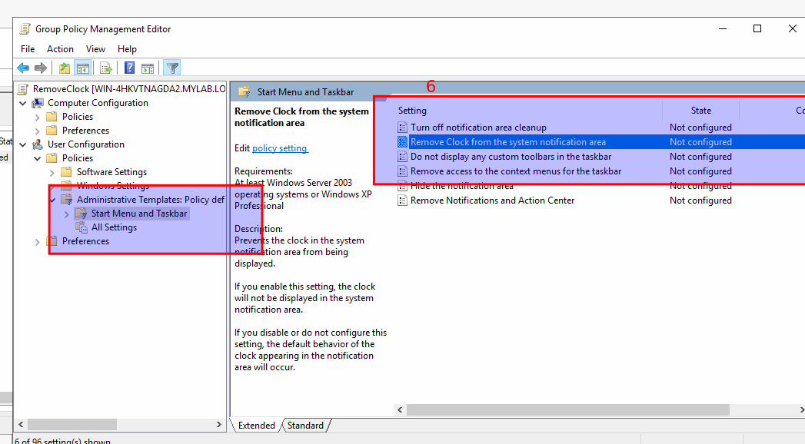
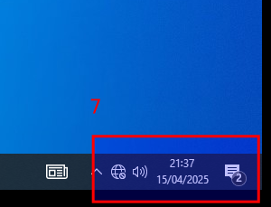

# 📝 Notes 
---

## ✅ To apply new policies, follow these steps:

- Click on **Tools**
- Select **Group Policy Management**

  

- Select the **Organizational Unit (OU)** where you want to apply the new policy
- Right-click it → Select **Create a GPO in this domain, and Link it here**

  

- Let's assume we want to **disable the clock** for the IT OU:
  - Right-click on **IT (OU)** → Select **Create a GPO in this domain, and Link it here**

    

- You will find many policies available. To find the one you need, use the **filter/search**:

    

- Choose the desired policy → Right-click → **Enable** → Click **OK**

    
   


<b>🕒 Note:
```By default, group policies are updated every 90 minutes.  
To apply the policy immediately:
1. Go to the user’s machine
2. Press `Win + R`
3. Type: `gpupdate /force`
4. Sign out and log in again to see the policy applied.
```

## before apply policy
 

## after apply policy
 
