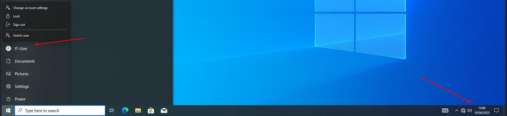

# 🚫 How to Exempt a User from Applying a Group Policy

In the previous lab, we learned how to apply a Group Policy to an Organizational Unit (OU).  
In this guide, we'll explain how to **exclude (exempt)** a specific user from that policy.

---

## ✅ Steps:

1. Go to `Tools` → `Group Policy Management`
2. Choose the **OU** where the Group Policy is applied
3. Click the **Delegation** tab
4. Click **Advanced**
5. Add the user you want to exempt
6. Find **"Apply group policy"** and set it to **Deny**

---

### 📸 Screenshots:

  
  
  

---

## 🔍 After Exempting the User

You should now see that the user is excluded from the policy.

---

