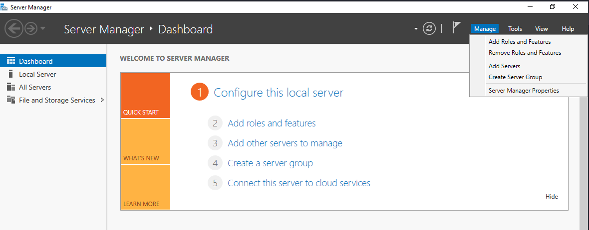
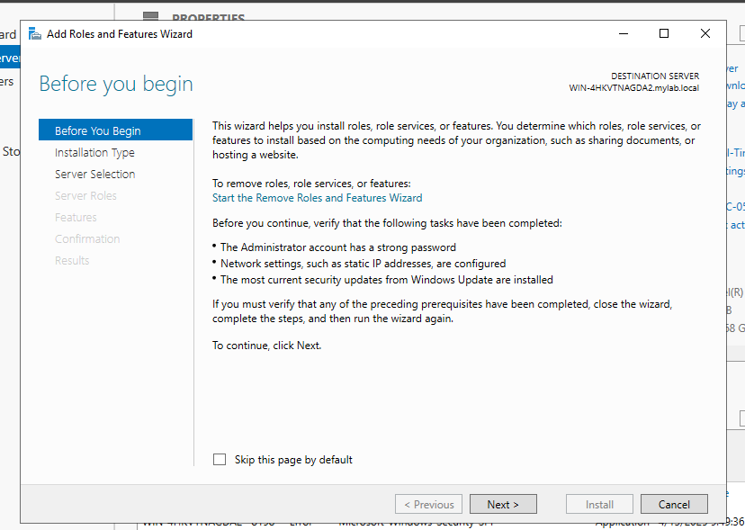
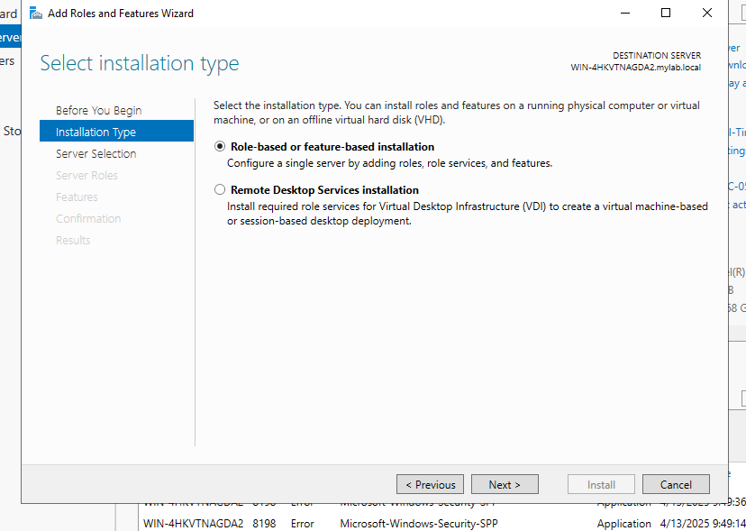
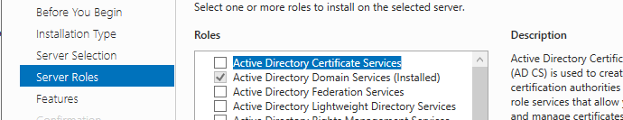
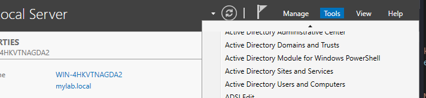
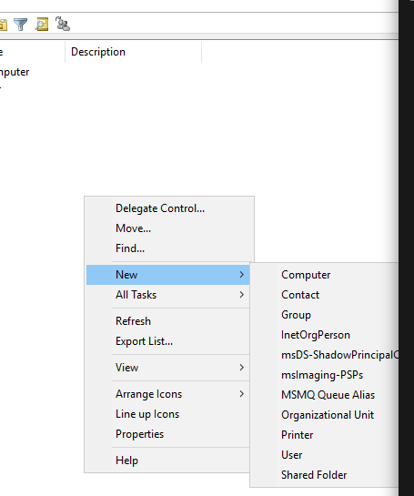
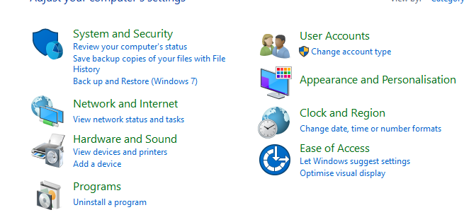
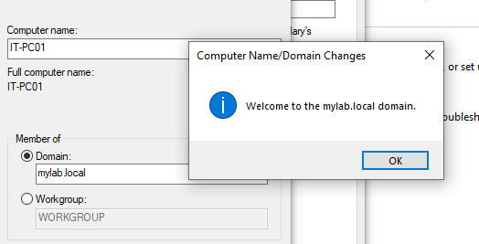
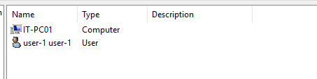

## Setup My Active Directory Lab

### 1. Install Windows Server and Windows 10/11
First, install Windows Server and a client OS like Windows 10 or 11. You can follow this tutorial by Eng. Mohamed Zohdy:

[Installation Video Playlist](https://www.youtube.com/watch?v=hYRNvdcmPfU&list=PLDxVq3TlR9y2sMXaL_yLp-r6pUpevgC-w)

---

## Setup Active Directory on Windows Server

1. Open **Server Manager**, then click **Add Roles and Features**.
   
   
   
   
   

2. After installation, go to **Tools** and select **Active Directory Users and Computers**.
   
   
    
3. To create a new Organizational Unit:
   - Right-click your domain name
   - Click **New** > **Organizational Unit**
   
     

4. Create a new user account that will be used to join the domain from the client machine.

---

## Setup on Windows 10 Client

1. Open **Control Panel** > **Clock and Region**, and set the correct time.
  
   
   

2. Go to **Control Panel** > **Network and Internet** > **Network and Sharing Center**:
   - Click on **Ethernet0**
   - Click **Properties**
   - Select **Internet Protocol Version 4 (TCP/IPv4)** and click **Properties**
   - Set a manual IP address in the same subnet as your domain controller
   - Use the domain controller's IP as the **DNS server**

3. Go to **Settings** > **System** > **About** > **Advanced System Settings**:
   - Click **Change** to rename the PC and join the domain
   - Enter your domain (e.g., `mylab.local`)
   - Enter the username and password of the domain user created earlier
   - If an error occurs like *"cannot identify domain"*, verify DNS configuration and network reachability using `ping <domain_ip>`

4. After successful domain join:
   - You’ll get a confirmation message

      
   - Restart the client machine
   - Log in using **Other User** and provide the 

---

## Back to Windows Server

1. Open **Server Manager** > **Tools** > **Active Directory Users and Computers**
2. Verify that the new computer object appears under the domain.
   
   