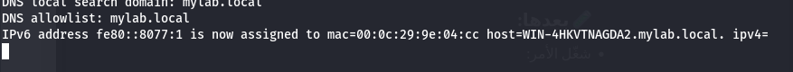
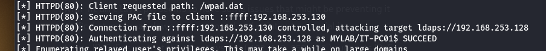
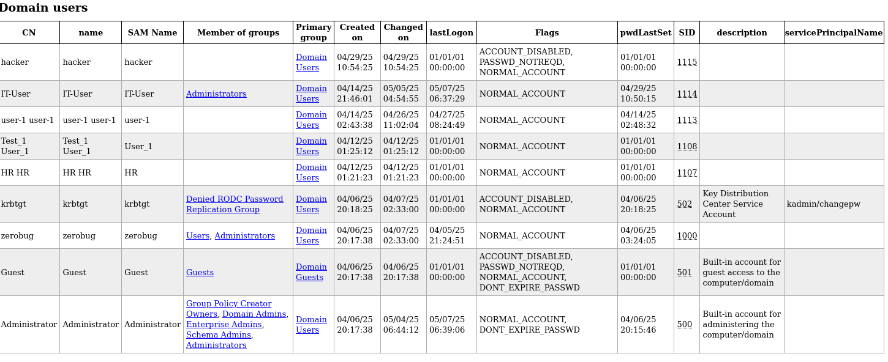

### What is IPv6 Attacks in AD?
   - This attack allows the attacker to spoof DNS using tools like **mitm6** and relay NTLM authentication requests to a Domain Controller (DC).

### Why does it happen?
   - The reason for this is that the NTLM protocol does not verify whether the sender is the correct user or not.

### How to Launch this Attack
   - If IPv6 is enabled in Active Directory, this attack can be executed. If IPv6 is not enabled, the attack cannot be carried out.
----
### Steps
1. **Run mitm6**:
   ```bash
   sudo mitm6 -d mylab.local
   ```
   When you run this tool, it will start manipulating traffic between network devices.


2. **Capture NTLM requests**: 
   After starting **mitm6**, if any device on the network performs an action like **rebooting or logging in**, you can capture NTLM relay requests from the domain controller by setting up **ntlmrelayx.py**.
   ```bash
   sudo ntlmrelayx.py -6 -t ldaps://<target-ip> -wh fake.mylab.local -l leetme
   ```
   This will forward the captured authentication request to **fake.mylab.local**, where it will be relayed to the **Domain Controller**.
   

3. **Access the leetme folder**:
   - Once the requests are captured, you can navigate to the **leetme** folder to gather information about **domain users, computers, and groups**.
   

---

### How to Protect Against This Attack
1. **Disable IPv6**:
   - The simplest and first step is to disable IPv6 if it’s not being used in your network. This reduces the chance of attacks relying on IPv6 manipulation.

2. **Disable NTLM or use modern authentication**:
   - It is crucial to disable NTLM within the network or at least restrict its usage. You can use more secure authentication methods such as **Kerberos** instead of NTLM.

3. **Use tools to detect DNS Spoofing**:
   - Use tools that can detect DNS Spoofing or MITM attacks on the network to spot attempts to manipulate traffic.

4. **Keep Active Directory updated and ensure apps don't use NTLM unnecessarily**:
   - Ensure that Active Directory is kept up to date and the network is using modern, more secure protocols instead of NTLM whenever possible.

