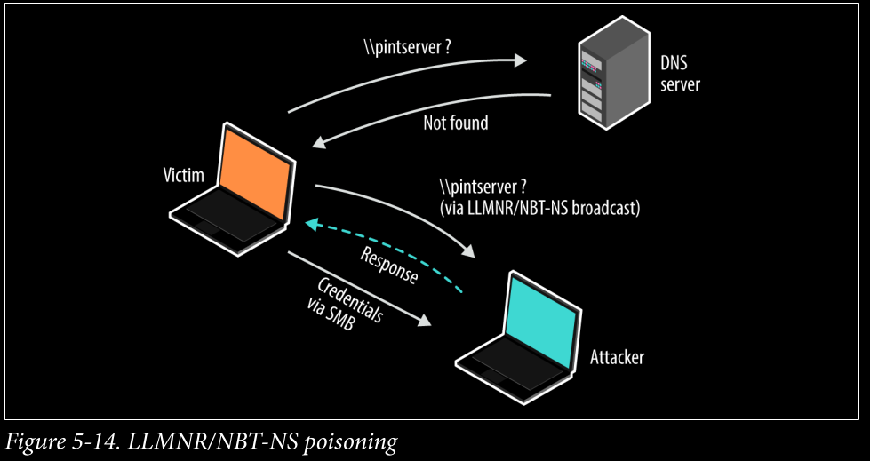

##  What is LLMNR( Link-Local Multicast Name Resolution)?

- **LLMNR** resolves **IPv4/IPv6** addresses to hostnames on local networks **without using a DNS server**.
- Uses **UDP port 5355** and is **enabled by default** on most Windows machines.
- When a DNS query fails, the system sends an **LLMNR broadcast** to attempt resolution.
-  **LLMNR is unauthenticated**, making it vulnerable to spoofing.

---


## How LLMNR Works

```text
When a user requests a named resource (e.g., \\fileserver), the system follows this order:
1. Check if the name refers to the local machine.
2. Check cache or local hosts file (C:\Windows\System32\drivers\etc\hosts).
3. Query the configured DNS server.
4. If DNS fails, fall back to LLMNR or NBT-NS.
```
---

## LLMNR Poisoning Attack

- An attacker uses tools like **Responder** to listen for LLMNR queries.
- When a victim mistypes a name (e.g., \\fielserver), the attacker **spoofs** the response.
- The victim unknowingly **sends authentication data** (username + **NTLMv2 hash**) to the attacker.
- This hash can later be **cracked offline** using tools like `hashcat` or `john`.
> 


---

##  Lab Application Using Responder

```bash
sudo responder -I <network-interface> -wd

-w : Enable fake web server
-d : Enable DHCP spoofing
```

1. Start Responder in your Kali/Attacker machine.

2. On the victim (domain-connected machine), mistype a shared folder name.
 
3. Observe the LLMNR traffic in Wireshark (or Responder output).
 
4. Capture username and NTLMv2 hash.
 
5. Crack the hash using:

 ```bash
   hashcat -m 5600 hashes.txt wordlist.txt --force
 ```

---

##  Defenses Against LLMNR/NBT-NS Attacks

### On Domain Controller or via GPO:

-  **Disable LLMNR:**
  - Group Policy → `Computer Configuration` → `Administrative Templates` → `Network` → `DNS Client`
  - Set **"Turn off Multicast Name Resolution"** to **Enabled**

-  **Disable NBT-NS:**
  - Go to Network Adapter → Properties → IPv4 → Advanced → WINS tab
  - Set **NetBIOS setting** to **Disable NetBIOS over TCP/IP**


---

